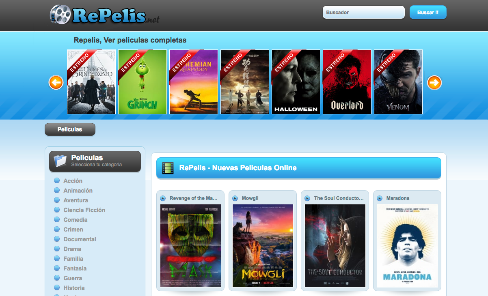

# Video Site


# Requeriments

- Node.js 8.x or higher


# Installation
Simply run
```
    npm install
```

# Configuring
Go ahead and edit config.js file to your preferences. Here is explained what does each config means:

``` js
module.exports = {
    port: 3000, // Port where HTTP Server will run
    paths: { // Contains the relative paths to website files
        website: './public/example.website', // Website base path
        static: './public/example.website/static', // Static files path
        partials: './public/example.website/templates', // Partial paths
    },
};
```

# Running
Just run
```
    node app.js
```

